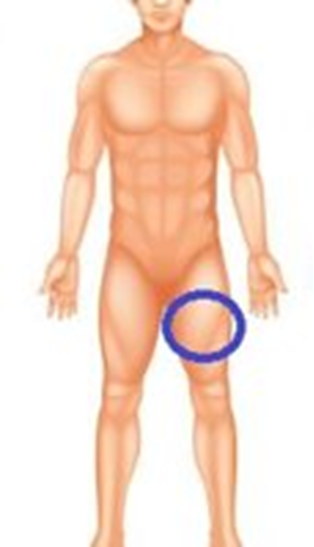

# Human Activity Recognition

The Human Activity Recognition System repository provides a comprehensive guide, code samples, and instructions to help you build and deploy a system capable of recognizing human activities based on sensor data. It combines data pre-processing, machine learning, Arduino integration, and Jupyter Notebook analysis, making it a valuable resource for anyone interested in developing and implementing human activity recognition applications.

## Table of Contents

- [Getting Started](#getting-started)
	- [Data Collection](#1.-data-collection)
	- [Data Pre-processing & Model Training](#2.-data-pre-processing-&-model-training)
	- [Model Deployment & Prediction](#3.-model-deployment-&-prediction)
- [Features](#features)
- [Configuration](#configuration)
- [Documentation](#documentation)
- [Acknowledgments](#acknowledgments)
- [Contributing](#contributing)
- [License](#license)
- [Contact](#contact)

## Getting Started

This project is a big one, it's divided to three parts:
1. **Data Collection**: How to collect the data.
2. **Data Pre-processing & Model Training**: Cleaning data, model selection and training. 
3. **Model Deployment & Prediction**: Deploy the model on Arduino platform to make a real-time prediction.

Let's start!

### 1. Data Collection

1. Clone or Download the repository to your local machine using the following command:
```
git clone https://github.com/kershrita/Human-Activity-Recognition.git
```
2. Navigate to [Data Collection](Data%20Collection/Data%20Collection.ino) file.
3. Open the file using Arduino IDE.
4. Make sure that you have installed nesscessary ESP8266 NodeMCU board and libraries [[Adafruit_MPU6050](Libraries/Adafruit_MPU6050.rar), [Adafruit_SSD1306](Libraries/Adafruit_SSD1306.rar)].
5. Assemble the circuit according to this figure.

6. Components
	- 1 * ESP8266 NodeMCU
	- 1 * MPU-6050 Module
	- 1 * TP4056 Charger Module
	- 1 * 3.7V Battery
	- 1 * Voltage Regulator
	- 1 * LED
	- 1 * 220 Ohms Resistor
	- 1 * Switch
	- 1 * Power Jack

7. Connect ESP8266 NodeMCU to the computer then upload the code.
8. Place the device in this area.



9. Open Serial Monitor, enter the sample label. There is a time delay 5 seconds to do the activity to collect sensor readings for this activity.
10. Repeat this cycle until you collect your desired samples.
11. Copy the output from the serial monitor then past it in a text notepad and save the file.

### 2. Data Pre-processing & Model Training

1. Navigate to [HAR using SVM](Model%20Building/HAR%20using%20SVM.ipynb) notebook file.
2. Copy the collected dataset file and place it with the notebook in the same folder.
3. Open it using Jupyter Notebooks or Google Colab or what you want.
4. Make sure that you have installed nesscessary libraries:
```
pip install micromlgen mlxtend numpy pandas matplotlib scikit-learn
```
5. Run the cells from top to bottom.
6. When you reach the model training cell you will find that the model has trained using Support Vector Machine Classifier. That's algorithm was the best one has give me a high accurcy 98.3%.
7. Using micromlgen library we will use module named port. This module used to deploy our model.

### 3. Model Deployment & Prediction

1. Navigate to [Prediction](Prediction/Prediction.ino) file.
2. Copy the trained model file then past it with the prediction arduino code in the same folder.
3. Open the prediction file & connect the cable to the computer.
4. Open the "Tools" menu and select the appropriate board and port for your Arduino board.
4. Make sure that you have installed nesscessary libraries [EloquentTinyML](Libraries/EloquentTinyML.rar).
5. Replace the Wi-Fi network credentials (SSID and password) with your own network credentials.
6. Upload the code to the Arduino board.
7. Access the web server by navigating to the IP address of the board in a web browser.


**Notes**: In folder [Documents](Documents)
- [3d Box](Documents/HAR%20Box.stl) designed for the project.
- Documentation and some guidance files if you have a problem you can find the solution there or maybe contact with me to solve it.
- If you want to plot Accelerometer & Gyroscope in serial plotter you can use [plotterMPU](plotterMPU/plotterMPU.ino) code.

## Features

- **Activity Classification**: Accurately classifies and recognizes different human activities based on sensor data, including walking, running, sitting, standing, and specific actions.
- **Real-time Monitoring**: Processes sensor data in real-time, allowing continuous monitoring and recognition of human activities as they happen.
- **Multi-Sensor Support**: Utilizes data from multiple sensors to capture a comprehensive understanding of human activities, enhancing accuracy and robustness.
- **Data Pre-processing**: Includes techniques to clean and normalize sensor data, improving the quality of input for the classification model.
- **Machine Learning Algorithms**: Employs machine learning algorithms such as decision trees, SVM, random forests, or deep learning models to learn patterns and accurately classify activities.
- **Model Training and Evaluation**: Supports model training and fine-tuning using labeled data, with evaluation metrics to assess model performance.
- **Integration with Arduino**: Provides instructions and code samples for deploying the model on an Arduino board, enabling real-time activity recognition in embedded systems or IoT applications.
- **Flexibility and Customization**: Allows users to customize the system by choosing sensors, adjusting model parameters, and incorporating additional features to meet specific requirements.

## Configuration

The Human Activity Recognition (HAR) System can serve the following key features:

- **Accurate and Real-Time Health and Fitness Data**: The system provides accurate and real-time data on users' health and fitness activities. This enables users to track their progress, monitor their performance, and make informed decisions to achieve their goals more effectively.
- **Form and Technique Guidance**: The system offers guidance and feedback on proper form and technique during physical activities. This helps users maintain correct posture, avoid incorrect movements, and reduce the risk of injuries. By providing real-time feedback, the system helps users improve their performance and optimize their workout routines.
- **Assistance for Elderly or Disabled Individuals**: The HAR system assists elderly or disabled individuals with safety and daily living activities. By recognizing and analyzing their activities, the system can provide support and reminders for medication intake, mobility assistance, or other necessary tasks. This helps promote independence, enhance safety, and improve the overall quality of life for these individuals.
- **Goal Tracking and Achievement**: The system allows users to set personal goals and track their progress. It provides insights into activity levels, calorie burn, and other relevant metrics, enabling users to monitor their performance and make adjustments as needed to reach their desired targets.
- **Customization and Personalization**: The HAR system offers customization and personalization options to cater to individual preferences and needs. Users can set their own activity profiles, define specific target zones, and receive tailored recommendations and feedback based on their unique requirements.
- **Integration with Mobile Apps and Wearable Devices**: The system seamlessly integrates with mobile applications and wearable devices, allowing users to access their activity data, receive notifications, and sync their progress across multiple platforms. This enhances convenience and provides a comprehensive overview of their health and fitness activities.
